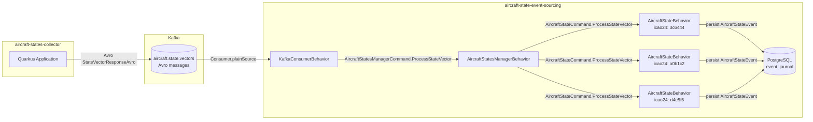

# Aviation Project

A sample aviation data pipeline built with Java 21, Quarkus, Apache Pekko, Kafka, and PostgreSQL.

The project is split into two modules:

| Module | Purpose | Technology |
|--------|---------|------------|
| `aircraft-states-collector` | Collects aircraft state vectors and publishes them to Kafka | Quarkus, Apache Avro, Kafka Producer |
| `aircraft-state-event-sourcing` | Consumes the vectors, persists them as events, and maintains per-aircraft state | Apache Pekko Typed, Event Sourcing, Kafka Consumer, PostgreSQL |

---

## Overall architecture



---

## Modules

### aircraft-states-collector

A Quarkus-based service that gathers aircraft state vectors and publishes them to the Kafka topic
`aircraft.state.vectors` as Avro-serialized `StateVectorResponseAvro` messages.

Key technologies:
- Quarkus 3.x
- Java 21
- Apache Avro
- Kafka Producer

See `aircraft-states-collector/README.md` for details.

### aircraft-state-event-sourcing

A Pekko Typed event-sourcing processor that:

1. Consumes Avro messages from Kafka.
2. Routes each `StateVectorAvro` to a dedicated persistent actor based on `icao24`.
3. Persists an `AircraftStateEvent` to PostgreSQL via Pekko Persistence JDBC.
4. Maintains the latest `AircraftState` in memory for each aircraft.

Key technologies:
- Apache Pekko Typed
- Pekko Persistence Typed + JDBC Journal
- Pekko Connectors Kafka
- PostgreSQL
- Cucumber JVM + Testcontainers

See `aircraft-state-event-sourcing/README.md` for details.

---

## Prerequisites

- Java 21
- Maven 3.9+
- Docker or Podman (required for Testcontainers-based tests)

---

## Build the entire project

```bash
mvn clean install
```

To build a specific module:

```bash
cd aircraft-states-collector
mvn clean install

cd ../aircraft-state-event-sourcing
mvn clean install
```

---

## Running the pipeline

1. Start PostgreSQL and Kafka.
2. Run the collector to publish aircraft state vectors:
   ```bash
   cd aircraft-states-collector
   mvn quarkus:dev
   ```
3. Run the processor to consume and persist the vectors:
   ```bash
   cd aircraft-state-event-sourcing
   mvn compile exec:java -Dexec.mainClass="aviation.Main"
   ```

---

## Running tests

### aircraft-states-collector

```bash
cd aircraft-states-collector
mvn test
```

### aircraft-state-event-sourcing

```bash
cd aircraft-state-event-sourcing
mvn test
```

The event-sourcing tests use Testcontainers to start Kafka and PostgreSQL automatically.

---

## Project structure

```
aviation-project/
├── README.md                          # This file
├── aircraft-states-collector/         # Quarkus Kafka producer module
│   ├── README.md
│   ├── pom.xml
│   └── src/...
└── aircraft-state-event-sourcing/     # Pekko event-sourcing consumer module
    ├── README.md
    ├── pom.xml
    └── src/...
```

---

## Key concepts

### Event sourcing

Instead of storing only the latest state, every state change is appended as an immutable event.
The current state is derived by replaying events. This provides:

- A complete audit trail of every state change.
- The ability to rebuild state from the event log.
- Clear separation between commands, events, and state.

### Actor model

Each aircraft is represented by its own persistent actor (`AircraftStateBehavior`).
Actors are:

- Lightweight and isolated.
- Identified by `icao24`.
- Supervised by the `AircraftStatesManagerBehavior`.

### Kafka as the ingestion bus

Kafka decouples the collector from the processor:

- The collector produces messages without knowing about the processor.
- The processor consumes messages at its own pace.
- Multiple processors can be scaled independently if needed.

---

## Configuration

### aircraft-state-event-sourcing

Configuration is loaded from `src/main/resources/application.conf`.

| Setting | Default | Environment variable override |
|---------|---------|-------------------------------|
| Kafka bootstrap servers | `localhost:9092` | `KAFKA_BOOTSTRAP_SERVERS` |
| Kafka topic | `aircraft.state.vectors` | `KAFKA_TOPIC` |
| PostgreSQL URL | `jdbc:postgresql://localhost:5432/aviation` | `jdbc-journal.slick.db.url` |
| PostgreSQL user | `aviation` | `POSTGRES_USER` |
| PostgreSQL password | `aviation` | `POSTGRES_PASSWORD` |

---

## Happy-path scenario

The `aircraft-state-event-sourcing` module verifies the following Cucumber scenario:

```gherkin
Feature: Aircraft state event sourcing

  Scenario: Consuming three aircraft state messages creates three persisted actors
    Given Kafka and PostgreSQL are running
    And the event-sourcing actor system is started
    When 3 sample aircraft state messages are consumed from the "aircraft.state.vectors" topic
    Then 3 aircraft state events are persisted in the database
    And 3 event sourced persistent actors exist in memory
    And each actor represents the latest aircraft state
```
