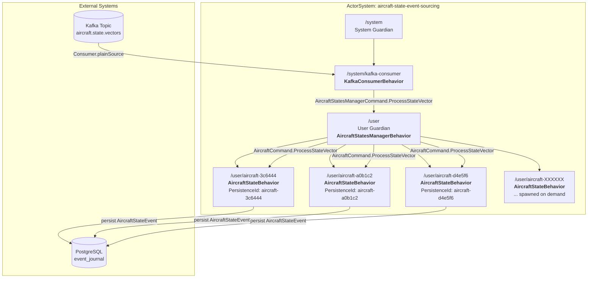

# Aircraft State Event Sourcing

A Pekko Typed event-sourcing processor that consumes aircraft state vectors from Kafka,
persists them as events in PostgreSQL, and maintains one in-memory event-sourced actor per aircraft.

---

## What it does

The `aircraft-state-event-sourcing` module listens to the Kafka topic `aircraft.state.vectors`
(produced by the `aircraft-states-collector` module). For every aircraft state vector received,
it:

1. Deserializes the Avro message.
2. Routes the state vector to a dedicated persistent actor identified by the aircraft's `icao24`.
3. Persists an `AircraftStateEvent` to the PostgreSQL journal.
4. Updates the actor's in-memory `AircraftState` aggregate.

The result is a durable, queryable, per-aircraft state model built from an append-only event log.

---

## Prerequisites

- Java 21
- Maven 3.9+
- Docker or Podman (for Testcontainers-based tests)

---

## Build

```bash
mvn clean compile
```

## Run tests

```bash
mvn clean test
```

Tests use Testcontainers to spin up Kafka and PostgreSQL, apply the journal schema, start the actor
system, publish sample Avro messages, and assert that events are persisted and actors reflect the
latest state.

---

## Technology stack

| Layer | Technology |
|-------|------------|
| Actor model | Apache Pekko Typed |
| Event sourcing | Pekko Persistence Typed + JDBC journal |
| Kafka consumption | Pekko Connectors Kafka |
| Serialization | Apache Avro |
| Database | PostgreSQL |
| Testing | Cucumber JVM + Testcontainers + AssertJ |

---

## Architecture

### Actor hierarchy



### Message flow

```
Kafka Topic: aircraft.state.vectors
         |
         | Consumer.plainSource
         v
+--------------------+
| KafkaConsumer      |
| Behavior           |
| /system/kafka-     |
| consumer           |
+--------------------+
         |
         | AircraftStatesManagerCommand.ProcessStateVector
         v
+--------------------+
| AircraftStates     |
| ManagerBehavior    |
| /user              |
+--------------------+
         |
         | AircraftCommand.ProcessStateVector
         +---------+---------+---------+
                   |         |         |
                   v         v         v
          +-----------+ +-----------+ +-----------+
          | Aircraft  | | Aircraft  | | Aircraft  |
          | State     | | State     | | State     |
          | Behavior  | | Behavior  | | Behavior  |
          | 3c6444    | | a0b1c2    | | d4e5f6    |
          +-----------+ +-----------+ +-----------+
                   |         |         |
                   v         v         v
          +-------------------------------+
          | PostgreSQL event_journal      |
          | AircraftStateEvent persisted  |
          +-------------------------------+
```

### Key actors

| Actor | Path | Responsibility |
|-------|------|----------------|
| **AircraftStatesManagerBehavior** | `/user` | Guardian actor. Receives state vectors from Kafka and routes or spawns per-aircraft actors. |
| **AircraftStateBehavior** | `/user/aircraft-{icao24}` | One event-sourced actor per aircraft. Persists `AircraftStateEvent` and maintains the latest `AircraftState`. |
| **KafkaConsumerBehavior** | `/system/kafka-consumer` | System actor that runs the Pekko Connectors Kafka source and forwards messages to the manager. |

---

## Domain model

### Shared attributes

`AircraftAttributes` is an immutable record containing all fields that describe an aircraft state
(e.g. `icao24`, `callsign`, `latitude`, `longitude`, `velocity`).

### Event

`AircraftStateEvent` wraps `AircraftAttributes`. It is the fact that is persisted to the journal.

### State

`AircraftState` wraps `AircraftAttributes`. It is the current aggregate state maintained by each
`AircraftStateBehavior`.

---

## Configuration

Configuration is loaded from `src/main/resources/application.conf`.

Key settings:

| Setting | Default | Override via |
|---------|---------|--------------|
| Kafka bootstrap servers | `localhost:9092` | `KAFKA_BOOTSTRAP_SERVERS` |
| Kafka topic | `aircraft.state.vectors` | `KAFKA_TOPIC` |
| PostgreSQL host | `localhost` | `POSTGRES_HOST` |
| PostgreSQL port | `5432` | `POSTGRES_PORT` |
| PostgreSQL database | `aviation` | `POSTGRES_DB` |
| PostgreSQL user | `aviation` | `POSTGRES_USER` |
| PostgreSQL password | `aviation` | `POSTGRES_PASSWORD` |

---

## Running the application

```bash
# Ensure PostgreSQL and Kafka are running and configured in application.conf or via env vars
mvn compile exec:java -Dexec.mainClass="aviation.Main"
```

Alternatively, package and run:

```bash
mvn package
java -jar target/aircraft-state-event-sourcing-1.0.0-SNAPSHOT.jar
```

---

## Test scenario

The Cucumber feature `aircraft_state_event_sourcing.feature` verifies the happy path:

```gherkin
Feature: Aircraft state event sourcing

  Scenario: Consuming three aircraft state messages creates three persisted actors
    Given Kafka and PostgreSQL are running
    And the event-sourcing actor system is started
    When 3 sample aircraft state messages are consumed from the "aircraft.state.vectors" topic
    Then 3 aircraft state events are persisted in the database
    And 3 event sourced persistent actors exist in memory
    And each actor represents the latest aircraft state
```

---

## Project structure

```
aircraft-state-event-sourcing/
├── pom.xml
├── README.md
├── src/main/avro/state-vector-response.avsc
├── src/main/java/aviation/
│   ├── Main.java
│   ├── actor/
│   │   ├── AircraftCommand.java
│   │   ├── AircraftStateBehavior.java
│   │   ├── AircraftStatesManagerBehavior.java
│   │   ├── AircraftStatesManagerCommand.java
│   │   └── KafkaConsumerBehavior.java
│   ├── domain/
│   │   ├── AircraftAttributes.java
│   │   ├── AircraftState.java
│   │   └── AircraftStateEvent.java
│   └── kafka/
│       └── AvroDeserializer.java
├── src/main/resources/application.conf
└── src/test/
    ├── java/aviation/
    │   ├── CucumberTest.java
    │   └── bdd/
    │       ├── steps/
    │       │   └── AircraftStateEventSourcingSteps.java
    │       └── support/
    │           ├── ActorStateAssertions.java
    │           ├── ActorSystemSupport.java
    │           ├── EventJournalAssertions.java
    │           ├── KafkaMessageProducer.java
    │           └── TestcontainersSupport.java
    └── resources/
        ├── features/aircraft_state_event_sourcing.feature
        └── schema.sql
```
